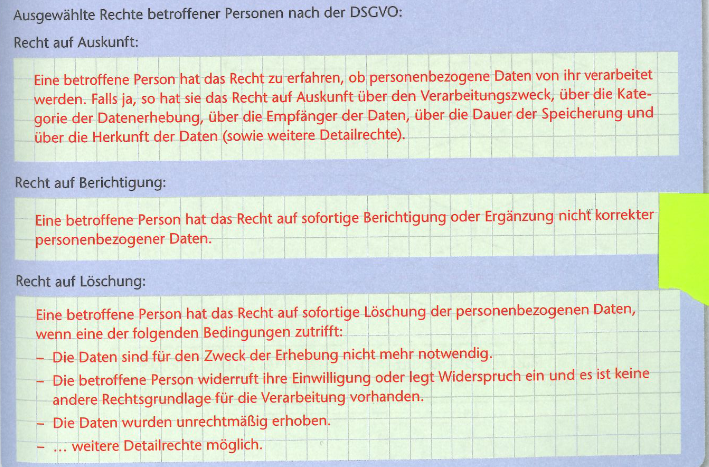
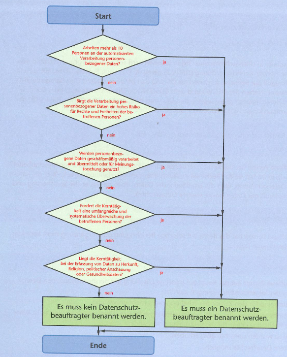
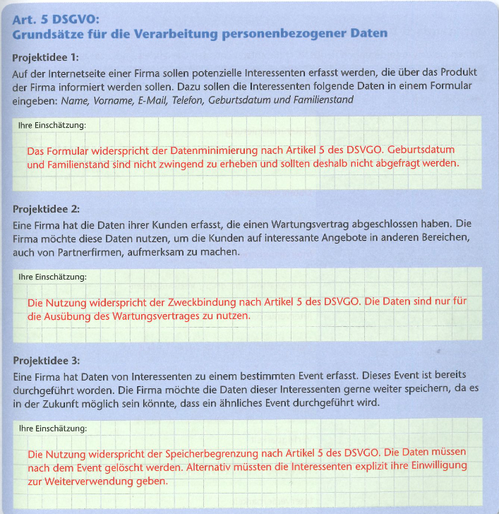
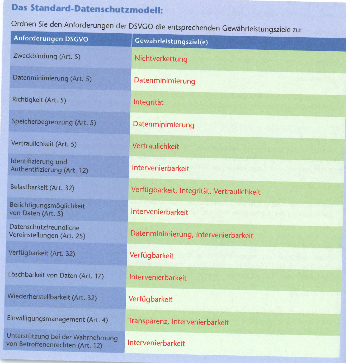

# Datenschutzgrundverordnung

[Zurück zur Übersicht](../readme.md)

## Gliederung

- [Inhalte](#inhalte)
- [Umgang mit personenbezogenen Daten](#umgang-mit-personenbezogenen-daten)
- [Standard-Datenschutzmodell](#standard-datenschutzmodell)
- [Quellen](#quellen)

---
---

## Inhalte

Abbildung 1

[Mehr](https://www.thomashelbing.com/de/info/dsgvo-zusammenfassung)

Abbildung 2

[Hoch](#gliederung)

---
---

## Umgang mit personenbezogenen Daten

Abbildung 3

[Hoch](#gliederung)

---
---

## Standard-Datenschutzmodell

Abbildung 4

[Hoch](#gliederung)

---
---

## Quellen

### Abbildungen

- Abb.1: rosa Buch
- Abb.2: rosa Buch
- Abb.3: rosa Buch
- Abb.4: rosa Buch

[Hoch](#gliederung)

---
---
