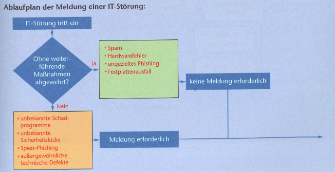
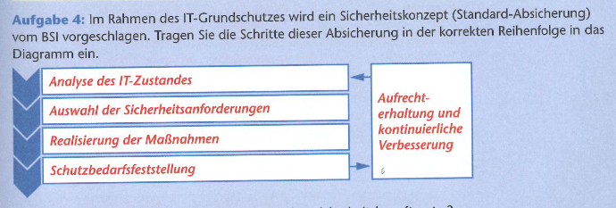

# Grundlagen IT-Sicherheit

[Zurück zur Übersicht](../readme.md)

## Gliederung

- [IT-Sicheheitsgesetz](#it-sicherheitsgesetz)
- [BSI](#bsi)
- [Sicherheitsleitlinie und Sicheheitskonzept](#sicherheitsleitlinie-und-sicheheitskonzept)
- [Quellen](#quellen)
---
---

## IT-Sicherheitsgesetz

```Text
Das IT-Sicherheitsgesetz soll einen Beitrag dazu leisten, die IT-Systeme und digitalen
Infrastrukturen Deutschlands zu den sichersten weltweit zu machen. Dabei hat es vor allem
die IT-Systeme der kritischen Infrastrukturen im Blick. Zu den kritischen Infrastrukturen
gehören die Sektoren deren Dienstleistung zur Versorgung der Allgemeinheit dient und deren
Ausfall oder Beeinträchtigung zu erheblichen Versorgungsengpässen oder zu Gefährdungen
der öffentlichen Sicherheit führen könnte.
```

- **Sektoren der kritischen Infrastruktur**
    - Transport und Verkehr
    - Finanz- und Versicherungswesen
    - Gesundheit
    - Informationstechnik und Telekommunikation
    - Ernährung
    - Wasser
    - Energie



Abbildung 1

[Hoch](#gliederung)

---
---

## BSI

```Text
Das BSI (Bundesamt für Sicherheit in der Informationstechnik) ist eine
Bundesbehörde, die die IT-Sicherheit in Staat, Wirtschaft und Gesellschaft fördern
und gewährleisten will.
```

- Aufgaben:
    - Sicherheit in der Informations- und Kommunikationstechnik für Privatpersonen
    - Sicherheit in der Informations- und Kommunikationstechnik für geschäftliche Anwender
    - Sicherheit in der Informations- und Kommunikationstechnik für Behörden
    - Veröffentlichung von Handlungsempfehlungen und Mindeststandards
    - Prüfung und Zertifizierung von Produkten und Dienstleistungen der IT
    - Warnung vor erkannten Sicherheitslücken und bestehenden Bedrohungen

[Mehr](https://www.egovernment.de/was-ist-das-bsi-und-was-sind-seine-aufgaben-a-579231/)

[Hoch](#gliederung)

---
---

## Sicherheitsleitlinie und Sicheheitskonzept

- **Sicherheitsleitlinie**:
    - Grundsatzdokument der Leitung
    - beinhaltet verbindliche Prinzipien
    - beinhaltet das angestrebte Niveau der Informationssicherheit in einer Institution
- **Sicherheitskonzept**:
    - beschreibt konkrete Maßnahmen zu Umsetzung der `Sicherheitsleitlinie`



Abbildung 2

[Hoch](#gliederung)

---
---

## Quellen

### Abbildungen

- Abb.1: rosa Buch
- Abb.2: rosa Buch

### Inhalt

- <https://www.egovernment.de/was-ist-das-bsi-und-was-sind-seine-aufgaben-a-579231/>

[Hoch](#gliederung)

---
---
