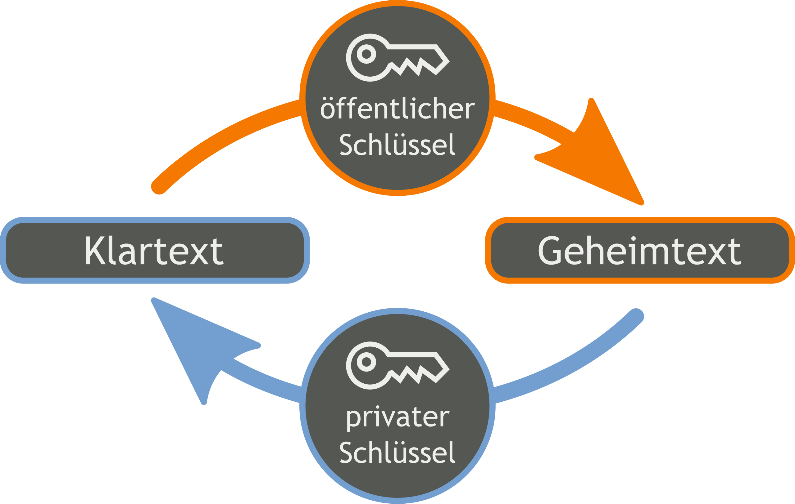

# Verschlüsselung

[Zurück zur Übersicht](../readme.md)

## Gliederung

- [Erklärung](#erklärung)
- [Symmetrische Verschlüsselung](#symmetrische-verschlüsselung)
- [Asymmetrische Verschlüsselung](#asymmetrische-verschlüsselung)
- [Hashing](#hashing)
- [Quellen](#quellen)

---
---

## Erklärung

- Verschlüsselung ist die von einem Schlüssel abhängige Umwandlung von „Klartext“ genannten Daten in einen „Geheimtext“ (auch „Chiffrat“ oder „Schlüsseltext“ genannt)
- Verschlüsselung dient zur Geheimhaltung von Nachrichten
- Die Wissenschaft des Verschlüsselns wird als Kryptographie bezeichnet

[Hoch](#gliederung)

---
---

## Symmetrische Verschlüsselung

- Symmetrische Verschlüsselungsverfahren verwenden zur Ver- und Entschlüsselung den gleichen Schlüssel
- Bei modernen symmetrischen Verfahren werden **Stromverschlüsselung** und auf einer **Blockverschlüsselung** basierende Verfahren unterschieden
- **Stromverschlüsselung**
  - Bei der Stromverschlüsselung werden die Zeichen des Klartextes jeweils einzeln und nacheinander verschlüsselt
  - ist ein kryptographischer Algorithmus zur symmetrischen Verschlüsselung, bei dem Zeichen des Klartextes mit den Zeichen eines Schlüsselstroms einzeln (XOR bei Bits) verknüpft werden
  - Der Schlüsselstrom ist normalerweise eine pseudozufällige Zeichenfolge, die aus dem Schlüssel abgeleitet wird
  - Bei selbstsynchronisierenden Stromchiffren gehen außer dem Schlüssel auch Teile der Nachricht in die Berechnung des Schlüsselstroms ein
- **Blockverschlüsselung**
  - Bei einer Blockverschlüsselung hingegen wird der Klartext vorab in Blöcke einer bestimmten Größe aufgeteilt
  - ist ein [deterministisches](https://de.wikipedia.org/wiki/Determinismus_(Algorithmus))(Wikipedia) Verschlüsselungsverfahren, das einen Klartextblock, d. h. einen Klartextabschnitt fester Länge, auf einen Geheimtext- oder Schlüsseltextblock fester (in der Regel der gleichen) Länge abbildet
  - Diese Abbildung wird dabei durch einen Schlüssel beeinflusst
  - Kennt man diesen, kann man aus dem Geheimtext wieder den Klartext berechnen, mit etwa dem gleichen Aufwand wie für das Verschlüsseln
  - Ohne Kenntnis des Schlüssels ist dies hingegen viel schwieriger, bei vielen modernen Blockchiffren ist dafür keine praktikable Methode bekannt

[Hoch](#gliederung)

---
---

## Asymmetrische Verschlüsselung

- Kennzeichen der asymmetrischen Verschlüsselung ist, dass zur Verschlüsselung ein völlig anderer Schlüssel als zur Entschlüsselung benutzt wird
- Man unterscheidet hier zwischen 
  - dem „öffentlichen Schlüssel“, der zum Verschlüsseln benutzt wird
  - dem „privaten Schlüssel“ zum Entschlüsseln des Geheimtextes
- Der private Schlüssel wird niemals weitergegeben oder gar veröffentlicht
- Der öffentliche Schlüssel hingegen wird dem Kommunikationspartner übergeben oder veröffentlicht
- Er kann dann von jedermann benutzt werden, um Nachrichten zu verschlüsseln
- Um diese jedoch entschlüsseln zu können, benötigt man den dazu passenden privaten Schlüssel
- Nur damit kann die verschlüsselte Nachricht wieder entschlüsselt werden
- Das heißt, noch nicht einmal der Verschlüssler selbst ist in der Lage, seine eigene Nachricht, die er mit dem öffentlichen Schlüssel der anderen Person verschlüsselt hat, wieder zu entschlüsseln

Abb. 1 [Quelle](#quellen)

- Das Verfahren kann übrigens auch „umgekehrt“ verwendet werden, indem eine Person ihren privaten Schlüssel nutzt, um damit eine Information zu verschlüsseln
- Nun ist jedermann, der Zugriff auf den öffentlichen Schlüssel hat, in der Lage, damit die Nachricht zu entschlüsseln
- Hier geht es meist nicht um die Geheimhaltung einer Nachricht, sondern beispielsweise um die Authentifizierung einer Person beziehungsweise die digitale Signatur einer Nachricht

[Hoch](#gliederung)

---
---

## Hashing

- Der Begriff Hashing (deutsch: zerhacken) bezeichnet die Transformation eines beliebig großen Datensatzes in eine Zeichenkette mit einer festen, kürzeren Länge, die den ursprünglichen Datensatz referenziert
- Mittels einer Hashfunktion werden die einzelnen Elemente aus dem Datensatz zunächst einem Schlüssel und dann den Hashwerten zugeordnet, die die originalen Daten auf bestimmte Weise repräsentieren
- Der Datensatz kann aus Zeichenfolgen, Listen, Dateien oder anderen Inhalten bestehen
- Die Schlüssel, die für diese Daten stehen, geben die Position der Elemente im Datensatz an, die mit ihnen durch Hashwerte verknüpft werden

### Verschlüsselung

- Bei der Verschlüsselung und der Entschlüsselung wird Hashing in Form von Hashing-Algorithmen verwendet
- Jedes Ergebnis einer Hashfunktion soll eindeutig mit einem Datensatz referenziert sein
- Deshalb sind kryptologische Hashfunktionen idealerweise auch Einwegfunktionen
- Wird nun eine Nachricht übermittelt, die einen eindeutigen Hashwert besitzt, können Sender und Empfänger die Integrität einer Nachricht überprüfen
- Kryptologische Hashfunktionen besitzen spezifische Eigenschaften, die es praktisch unmöglich machen, aus einem Hashwert die Schlüssel und somit die Ursprungsinformation zu berechnen

### Beispiel: MD5-Hashalgorithmus

- *Message-Digest Algorithm 5*
- ist ein Ver- und Entschlüsselungsalgorithmus, der aus beliebig langen Zeichenketten (Strings) einen Hashwert erzeugt, der immer 128 Bit lang ist
- MD5 Algorithmen gelten aktuell als **nicht mehr sicher**, wenn sie nicht durch weitere Verfahren (wie Salt zur Speicherung von Passwörtern) verfeinert werden
- Erklärung [Salt](https://de.wikipedia.org/wiki/Salt_(Kryptologie)) (Wikipedia)

[Hoch](#gliederung)

---
---

## Quellen

### Abbildungen

- Abb. 1: <https://de.wikipedia.org/wiki/Verschl%C3%BCsselung#/media/Datei:Orange_blue_public_key_cryptography_de.svg>

### Inhalt

- <https://de.wikipedia.org/wiki/Verschl%C3%BCsselung>
- <https://de.wikipedia.org/wiki/Stromverschl%C3%BCsselung>
- <https://de.wikipedia.org/wiki/Blockverschl%C3%BCsselung>
- <https://de.ryte.com/wiki/Hashing#Hashing_in_der_Verschl.C3.BCsselung>

[Hoch](#gliederung)

---
---
