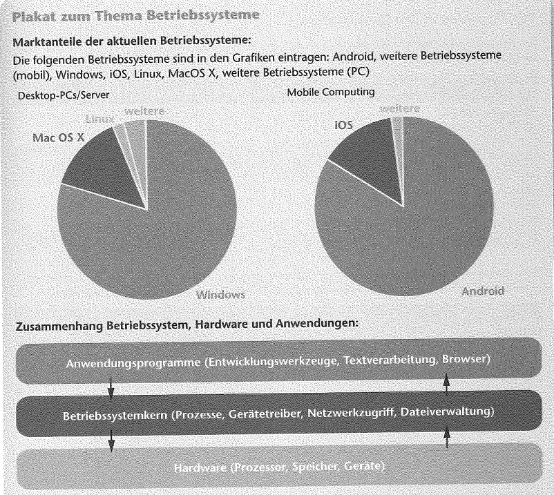

# Grundlagen IT-Systeme

[Zurück zur Übersicht](../readme.md)

## Gliederung

- [Konzeption einer IT-Ausstattung](#konzeption-einer-it-ausstattung)
- [Boolsche Algebra](#boolsche-algebra)
- [Dateifromate](#dateiformate)
- [Betriebssysteme und Anwendungssysteme](#betriebssysteme-und-anwendungssysteme)

---
---

## Konzeption einer IT-Ausstattung

- bei der Konzeption einer IT-Ausstattung solleten viele Punkte beachtet werden, dazu gehören:
  - Leistungsfähigkeit
  - Wirtschaflichkeit
  - Erweiterbarkeit
  - Zukunftsfähigkeit

### Begriffe

- Open Source

```text
Eine Open-Source-Software bietet einen öffentlichen Zugang zum Quelltext der Software.
Je nach Lizens kann der Quelltext genutzt, verändert oder weiterverarbeitet werden.
```

- GNU GPL

```text
Die GNU General Public License ist eine Software-Lizens, die den Benutzern die 
Möglichkeit gibt, die Software zu nutzen, zu ändern und zu verbreiten. 
Wenn die Software verändert und vertrieben wird, dann muss es unter den gleichen
Lizenz-Bedingungen geschehen. (Wieder GNU-GPL)
```

- Public Domain

```text
Der Begriff Public Domain bedeutet frei von Urheberrechten. Allerdings ist dieser
Rechtsbegriff nur in einigen englischsprachigen Ländern gültig. In Deutschland kommt
der Rechtsbegriff `Geminfreiheit` dem sehr nahe.
```

[Hoch](#gliederung)

---
---

## Boolsche Algebra

- In der Mathematik ist eine boolesche Algebra (oder ein boolescher Verband) eine spezielle algebraische Struktur, die die Eigenschaften der logischen Operatoren UND, ODER, NICHT sowie die Eigenschaften der mengentheoretischen Verknüpfungen Durchschnitt, Vereinigung, Komplement verallgemeinert
- Die boolesche Algebra ist die Grundlage bei der Entwicklung von digitaler Elektronik und wird dort als Schaltalgebra, etwa bei der Erstellung von Schaltnetzen, angewandt

### Zweielementige boolesche Algebra

- Konjunktion (UND)

/\ | **0** | **1**
-|-|-
**0** | 0 | 0
**1** | 0 | 1

- Disjunktion (ODER)

\/ | **0** | **1**
-|-|-
**0** | 0 | 1
**1** | 1 | 1

- Negation (NICHT)

-| \neg | 
-|-
**0** | 1
**1** | 0

[Mehr Inhalt](https://de.wikipedia.org/wiki/Boolesche_Algebra)(Wikipedia)

[Hoch](#gliederung)

---
---

## Dateiformate

Dateiendung | Ausgeschrieben | Anwedungfall
-|-|-
.jpg / .jpeg |  **J**oint **P**hotographic *E*xperts **G**roup (Gremium) | Ein Format zur Speicerung von Bilddaten mit Verlust.
.png | **P**ortable **N**etwork **G**raphics | Ein Format zur Speicerung von Bilddaten ohne Verlust.
.gif | **G**raphics **I**nterchange **F**ormat | Bildformat
.tiff | **T**agged **I**mage **F**ile **F**ormat | Ein Format zur Speicerung von Bilddaten ohne Verlust. Die Bilddaten werden bei diesem Format in Blöcken gespeichert
.mp4 | - | Ein Dateiformat zur Speicherung von komprimierten Audio- und Videodaten
.docx | | Ein Format zur Speicherung von Microsoft Word Dateien
.odt | **O**pen **D**ocument **T**ext | Ein Format zur Speicherung von Open-Office-Textdokumenten
.xlsx | - | Ein Format zur Speicherung von Microsoft Excel Dateien
.odp | **O**pen **D**ocument **P**resentation | Ein Format zur Speicherung von Open-Office-Präsentationen
.pdf | **P**ortable **D**ocument **F**ormat| Ein format zur platformunabhänigen Speicherung von Daten
.csv | **C**omma **S**epperated **V**alue | Ein Format zur Speicherung einfach Strukturrierter Daten

[Hoch](#gliederung)

---
---

## Betriebssysteme und Anwendungssysteme



Abb. 1 [Quelle](#quellen)

[Hoch](#gliederung)

---
---

## Quellen

### Inahlt

- <https://de.wikipedia.org/wiki/Boolesche_Algebra>
- Rosa Buch

### Abbildungen

- Abb. 1: rosa Buch
