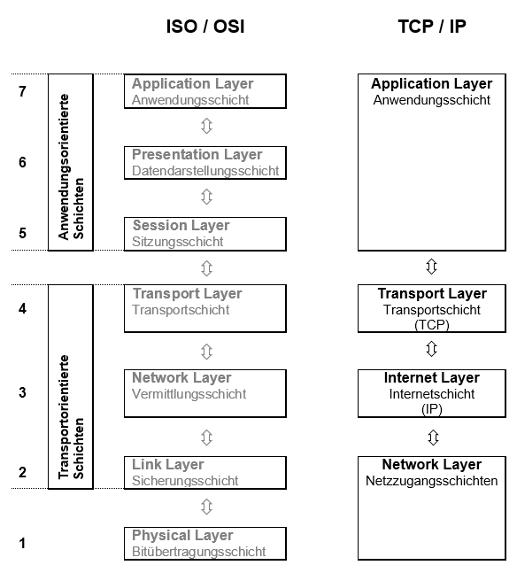
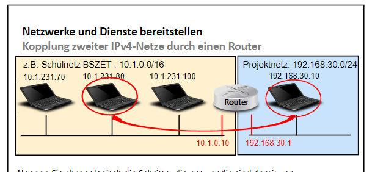

# Grundlagen Netzwerke

[Zurück zur Übersicht](../readme.md)

## Gliederung

- [OSI-Modell](#osi-modell)
- [TCP/IP-Modell](#tcpip-modell)
- [Routing](#routing)
- [Verkabelung](#verkabelung)
- [Quellen](#quellen)

---
---


## OSI-Modell


Abb. 1 [Quelle](#quellen)


[Hoch](#gliederung)

---
---

## TCP/IP-Modell



Abb. 2 [Quelle](#quellen)

[Hoch](#gliederung)

---
---

## Routing

```text
Netzwerk-Routing ist der Prozess, bei dem ein Pfad über ein oder mehrere Netzwerke ausgewählt wird. Die Routing-Prinzipien können für jede Art von Netzwerk gelten, von Telefonnetzen bis hin zu öffentlichen Verkehrsmitteln. In Netzwerken, die Pakete vermitteln, also beispielsweise dem Internet, wählt das Routing die Pfade aus, auf denen die Internet-Protokoll-Pakete (IP-Pakete) von ihrem Ursprung zu ihrem Ziel gelangen. Diese Internet-Routing-Entscheidungen werden von spezialisierten Teilen der Netzwerk-Hardware, den Routern, getroffen.
```



Abb. 3 [Quelle](#quellen)

[Hoch](#gliederung)

---
---

## Verkabelung

### Strukturierte Verkabelung

- sturkturierte Verkabelung kann in 3 Bereiche unterteilt werden:
  - Primärverkabelung
  - Sekundärverkabelung
  - Tertiärverkabelung
  - Für die Verkabelung wird in den meisten Fällen Glasfaserkabel (50 µm) mit einer maximalen Länge von 1.500 m verwendet
- **Pimärverkabelung** - Geländeverkabelung
  - Der Primärbereich wird als Campusverkabelung oder Geländeverkabelung bezeichnet
  - Er sieht die Verkabelung von einzelnen Gebäuden untereinander vor
  - Dazu sind vorzugsweise Glasfaserkabel (50 µm), aber auch Kupferkabel mit einer maximalen Länge von 500 m vorgesehen
- **Sekundärverkabelung** - Gebäudeverkabelung
  - Der Sekundärbereich wird als Gebäudeverkabelung oder Steigbereichverkabelung bezeichnet
  - Sieht die Verkabelung von einzelnen Etagen und Stockwerken untereinander innerhalb eines Gebäudes vor
- **Tertiärverkabelung** - Etagenverkabelung
  - Der Tertiärbereich wird als Etagenverkabelung bezeichnet
  - Er sieht die Verkabelung von Etagen- oder Stockwerksverteilern zu den Anschlussdosen vor
  - ährend sich im Stockwerksverteiler ein Netzwerkschrank mit Patchfeld befindet, mündet das Kabel am Arbeitsplatz des Anwenders in einer Anschlussdose in der Wand, in einem Kabelkanal oder in einem Bodentank mit Auslass
  - Für diese relativ kurze Strecke sind Twisted-Pair-Kabel vorgesehen, deren Länge auf 90 m, zzgl. 2 mal 5 m Anschlusskabel, mit einer Gesamtlänge von 100 m begrenzt ist
  - Alternativ kommen auch Glasfaserkabel (62,5 µm) zum Einsatz

#### Elemente der Strukturierten Verkabelung

- `Patchfeld (Patchpanel)`
  - ist ein Verbindungselement für Kabel
  - Im Heimnetzwerk erlaubt ein Patchpanel das Zusammenführen von Netzwerk-Verlegekabel an einer zentralen Stelle
  - Zum Anschluss der Kabel verfügt ein Patchpanel über mehrere Ports
- `Patchkabel`
  - auch Rangierkabel
  - ist ein Kabeltyp der Netztechnik und der Telekommunikation, der für nicht fest verlegte Datenleitungen verwendet wird
  - Patchkabel sind meist vorkonfektioniert
  - Der Begriff Patchkabel bezieht sich ursprünglich auf kurze Kabellängen (zum Beispiel 50 cm oder 1 m), jedoch existiert keine bestimmte Kabelnormung, daher werden häufig jegliche variable, nicht fest verlegte Kabelverbindungen als Patchkabel bezeichnet
  - Patchkabel oder Anschlusskabel gibt es sowohl in Glasfaser- als auch in Kupfer-Ausführung, zum Beispiel Twisted-Pair- oder Twinax-(Koaxial)-Patchkabel für Ethernet oder InfiniBand
- `Anschlussdosen`
- `Netzwerkkabel`
- `Verteilerschränke`

[Hoch](#gliederung)

---
---

## Quellen

### Abbildungen

- Abb.1: <https://slideplayer.org/slide/644013/>
- Abb.2: <https://www.it-zeugs.de/was-ist-das-tcpip-modell.html>
- Abb.3: Unterichtsmaterial BSZETDD - Herr Hempel

### Inhalt

- <https://www.cloudflare.com/de-de/learning/network-layer/what-is-routing/>
- <https://www.heimnetzwerke.net/patchpanel-einfach-erklaert/>
- <https://www.elektronik-kompendium.de/sites/net/0908031.htm>
- <https://de.wikipedia.org/wiki/Patchkabel>

[Hoch](#gliederung)

---
---
