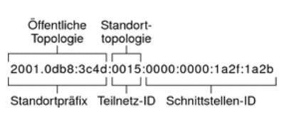
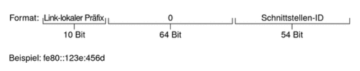

# IPv4 und IPv6

[Zurück zur Übersicht](../readme.md)

## Gliederung

- [IPv4](#ipv4)
- [IPv6](#ipv6)

---
---

## IPv4

### Aufbau

- eine IPv4 Adresse besteht aus 4 gleich großen Teilen
- diese 4 Teile bestehen aus 8 Bit welche dann in dezimaler Schreibweise angegeben werden

```text
Bsp. 1:
IPv4 Dezimal:   255.255.255.255
IPv4 Binär:     11111111.11111111.11111111.11111111

Bsp. 2:
IPv4 Dezimal:   192.168.22.156
IPv4 Binär:     11000000.10101000.00010110.10011100
```

### Wichtige Adressen

- `169.254.x.x` -> APIPA-Adresse 
- `127.0.0.1` -> LocalHost (alle 127.x.x.x)
- `192.168.0.0 bis 192.168.255.255`, `10.0.0.0 bis 10.255.255.255`, `172.16.0.0 bis 172.31.255.255` -> Private Adressbereiche

### Subnetzmaske
- eine Subnetzmaske gibt an welcher Teil der Netzwerkadresse Netzwerkteil und welcher Teil der Geräteteil ist

```text
Netzwerkadresse: 192.168.12.0
Subnetzmaske: 255.255.255.0

Netzwerkteil: 192.168.12
Geräteteil: 0 -> 8 Bit
```

- Eine Subnetzmaske kann auch, mit `/` getrennt, als Zahl hinter ein IP-Adresse stehen
- z.b.: `192.168.12.0/24`
- die Zahl (24) gibt an wie viele Bits von links an mit 1 gefüllt werden

```text
IPv4: 192.168.12.0/24
-> 24 bit von links an mit 1 auffüllen
-> Subnetzmaske: 11111111.11111111.11111111.00000000
-> Subnetzmaske: 255.255.255.0
```

### Anzahl möglicher Clients in einem Netz

- pro Oktet können gibt es "256" Plätze (2^8)
- es müssen immer 2 Plätze vom Gesamtergebnis abgezogen werden, da die erste Adresse immer die Netzwerkadresse ist und die letzte Adresse immer die Brodcastadresse ist

```text
Beispiel:

Netzwerkadresse: 192.168.12.0
Subnetzmaske: 255.255.255.0

-> es ist genau 1 Oktet als Geräteanteil verfügbar
-> Anzahl möglicher Clients = (2^8) - 2 = 256 - 2 = 254 Cleints

Beispiel 2:

Netzwerkadresse: 192.168.15.0/20

-> 20 Bit sind der Netzwerkanteil
-> 32 - 20 = 12 Bit Netzwerkanteil
-> Anzahl möglicher Clients = (2^12)-2 = 4096 - 2 = 4094 Clients
```

### Subnetting

- Gründe für Subnetting
  - ehrhöt die Anzahl verfügbarer Adressen
  - Mehr Sicherheit
  - bessere Netzwerkperformance

```text
Beispiel:

Netzwerkadresse: 192.168.12.0
Subnetzmaske: 255.255.255.128

Anzahl der zu bildenden Subnetze: 2


-> Ein Oktete frei = 256 / 2(Anazhl der Subnetze) = 128
-> Zweites Subnetz fängt bei .128 an

Subnetz 1:
Subnetzadresse: 192.168.12.0
Brodcastadresse: 192.168.12.127
IP-Range: 192.168.12.1 - 192.168.12.126

Subnetz 2:
Subnetzadresse: 192.168.12.128
Brodcastadresse: 192.168.12.255
IP-Range: 192.168.12.129 - 192.168.12.254
```

```text
Beispiel 2:

Netzwerkadresse: 192.168.12.0
Subnetzmaske: 255.255.255.192

Anzahl der zu bildenden Subnetze: 4


-> Ein Oktete frei = 256 / 4(Anazhl der Subnetze) = 64
-> Zweites Subnetz fängt bei .64 an
-> Drittes Subnetz fängt bei .128 an
-> Viertes Subnetz fängt bei .192 an

Subnetz 1:
Subnetzadresse: 192.168.12.0
Brodcastadresse: 192.168.12.63
IP-Range: 192.168.12.1 - 192.168.12.62

Subnetz 2:
Subnetzadresse: 192.168.12.64
Brodcastadresse: 192.168.12.127
IP-Range: 192.168.12.65 - 192.168.12.126

Subnetz 3:
Subnetzadresse: 192.168.12.128
Brodcastadresse: 192.168.12.191
IP-Range: 192.168.12.129 - 192.168.12.190

Subnetz 4:
Subnetzadresse: 192.168.12.192
Brodcastadresse: 192.168.12.255
IP-Range: 192.168.12.193 - 192.168.12.254

```

[Hoch](#gliederung)

---
---

## IPv6

### Aufbau

- eine IPv6-Adresse ist immer 128 Bit lang (Schreibweise kann gekürzt werden)
- ein Block ist dabei immer 16 Bit lang
- die Adresse ist Hexadezimal
- die ersten 48 Bit (3 Blöcke) heißen **Standortpräfix**
- die nächsten 16 Bit (1 Block) heißen **Teilnetz-ID**
- die letzten 64 Bit (4 Blöcke) heißen **Schnittstellen-ID** oder **Token**

Beispiel:

```text
IPv6-Adresse: 2001:0db8:3c4d:0015:0000:0000:1a2f:1a2b

Standortpräfix:     2001:0db8:3c4d
Teilnetz-ID:        0015
Schnittstellen-ID:  0000:0000:1a2f:1a2b
```

### Kürzung

- IPv6 Adressen können gekürzt werden:
  - alle führenden Nullen können weggelassen werden
  - Aufeinanderfolgende Blöcke mit Nullen können weggelassen werden dafür schreibt man dann `::`
  - **Dies kann nur 1 mal gemacht werden, am besten am längsten zusammenhängenden Block**
  - bei weiteren Null-Blöcken kann aus `:0000:0000:` `:0:0:` werden

Beispiel:

```text
Beispiel 1:
IPv6-Adresse:  2001:0db8:3c4d:0015:0000:0000:1a2f:1a2b

Gekürzte IPv6: 2001:db8:3c4d:15::12a2f:1a2b

Beispiel 2:
IPv6-Adresse:  4522:0db8:0000:0015:0000:0000:1a2f:1a2b

Gekürzte IPv6: 4522:db8:0:15::1a2f:1a2b

```

### Präfixe

- Das Teilnetzpräfix umfasst immer 64 Bit. Diese Bit umfassen 48 Bit für das Standortpräfix, zusätzlich zu den 16 Bit für die Teilnetz-ID
- Die folgenden Präfixe wurden für besondere Zwecke reserviert:
  - `2002::/16` -> Gibt an, dass ein 6to4-Routing-Präfix folgt
  - `fe80::/10` -> Gibt an, dass eine Link-lokale Adresse folgt
  - `ff00::/8`  -> Gibt an, dass eine Multicast-Adresse folgt

### Unicast-Adressen

Definiton [Unicast](https://en.wikipedia.org/wiki/Unicast) (Wikipedia)

- IPv6 umfasst zwei unterschiedliche Unicast-Adresszuweisungen:
  - Globale Unicast-Adresse
  - Link-lokale Adresse
- Der Typ einer Unicast-Adresse wird durch die linken (hochrangigen) Bit in der Adresse festgelegt, die das Präfix enthalten
- Die Unicast-Adresse ist in der folgenden Hierarchie strukturiert:
  - Öffentliche Topologie
  - Standorttopologie (privat)
  - Schnittstellen-ID

#### Globale Unicast-Adresse

- Die globale Unicast-Adresse ist weltweit einmalig im Internet



Abb.1 [Quelle](#quellen)

- Öffentliche Topologie
  - Das Standortpräfix legt die öffentliche Topologie Ihres Netzwerks gegenüber einem Router fest
  - Sie beziehen das Standortpräfix für Ihr Unternehmen von einem ISP oder der Regional Internet Registry (RIR)
- Standorttopologie und IPv6-Teilnetze
  - In IPv6 definiert die Teilnetz-ID ein administratives Teilnetz des Netzwerks und umfasst bis zu 16 Bit
  - Sie weisen die Teilnetz-ID während der Konfiguration eines IPv6-Netzwerks zu
  - Das Teilnetzpräfix legt die Standorttopologie für einen Router fest, indem es den Link angibt, dem das Teilnetz zugewiesen wurde
  - IPv6-Teilnetze gleichen konzeptuell IPv4-Teilnetzen, da jedes Teilnetz in der Regel einem Hardware-Link zugewiesen ist
  - IPv6-Teilnetz-IDs werden jedoch in hexadezimaler Notation, IPv4-Teilnetz-IDs hingegen in getrennter dezimaler Notation ausgedrückt
- Schnittstellen ID
  - Die Schnittstellen-ID gibt eine Schnittstelle für einen bestimmten Knoten an
  - Eine Schnittstellen-ID muss innerhalb des Teilnetzes einmalig sein
  - IPv6-Hosts können das Neighbor Discovery-Protokoll verwenden, um eigene Schnittstellen-IDs automatisch zu erzeugen
  - Neighbor Discovery generiert basierend auf der MAC- oder der EUI-64-Adresse der Host-Schnittstelle automatisch die Schnittstellen-ID
  - Sie können Schnittstellen-IDs auch manuell zuweisen
  - Dies wird für IPv6-Router und IPv6-konforme Server empfohlen
  - Eine Anleitung zum manuellen Erstellen einer EUI-64-Adresse finden Sie in RFC 3513, Internet Protocol Version 6 (IPv6) Addressing Architecture

#### Link-lokale Unicast-Adressen

- Die Link-lokale Unicast-Adresse kann nur auf dem lokalen Netzwerklink verwendet werden
- Link-lokale Adressen sind außerhalb des Unternehmens ungültig und werden nicht erkannt
- Das folgende Beispiel zeigt das Format einer Link-lokalen Adresse



Abb.2 [Quelle](#quellen)

- Ein Link-lokaler Präfix hat das folgende Format:
 - `fe80::Schnittstellen-ID/10`
- `fe80`
  - Hexadezimale Darstellung des binären 10-Bit-Präfixes 1111111010
  - Dieses Präfix identifiziert den Typ der IPv6-Adresse als Link-lokal
- Schnittstellen-ID
  - Hexadezimale Adresse der Schnittstelle, die in der Regel von der 48-Bit-MAC-Adresse abgeleitet wird

Informationen zu Multicast und Anycast [hier](https://docs.oracle.com/cd/E19957-01/820-2980/ipv6-overview-10/index.html)

[Hoch](#gliederung)

---
---

## Quellen

### Abbildungen

- Abb.1/2: <https://docs.oracle.com/cd/E19957-01/820-2980/ipv6-overview-10/index.html>

### Inhalt

- <https://docs.oracle.com/cd/E19957-01/820-2980/ipv6-overview-10/index.html>

[Hoch](#gliederung)

---
---
