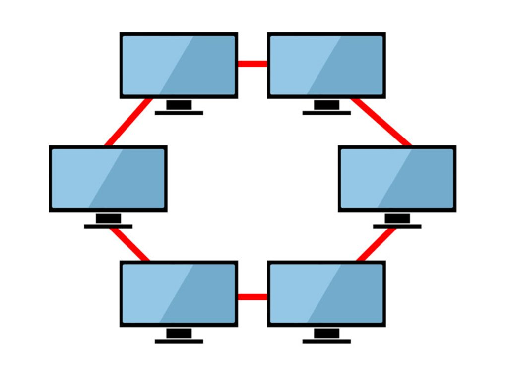

# Netzwerktopologien

[Zurück zur Übersicht](../readme.md)

## Gliederung

- [Erklärung](#erklärung)
- [Linien-Topologie](#linien-topologie)
- [Bus-Topologie](#bus-topologie)
- [Baum-Topologie](#baum-topologie)
- [Ring-Topologie](#ring-topologie)
- [Stern-Topologie](#stern-topologie)
- [Vermaschte Topologie](#vermaschte-topologie)
- [Vollvermaschte Topologie](#vollvermaschte-topologie)
- [Quellen](#quellen)

---
---

## Erklärung

- Eine Netzwerktopologie zeigt die Verbindungen, wie Geräte in einem Netzwerk miteinander verbunden sind
- **Physikalische Topologie**: Die Netz-Verkabelung in den Räumen (Infrastruktur-Plan)
- **Logische Topologie**: Datenfluss zwischen Netzwerk-Geräten (vereinfachtes Diagramm)
- Fast jedes Unternehmen benötigt eine mehr oder weniger ausgeprägte Netzwerktopologie für ihre Computer- und IT-Netzwerke.
- Mit der Topologie bestimmt man die Ausfallsicherheit dieser Netze
- Das heißt, wenn eine Verbindung ausfällt, kann das Netzwerk im Optimalfall diese Verbindung durch einen anderen Weg ausgleichen – Die Netzwerkgeräte sind weiterhin alle erreichbar

[Hoch](#gliederung)

---
---

## Linien-Topologie

- Alle Teilnehmer sind nacheinander in Reihe geschaltet
- Es gibt einen Anfangs- und einen End-Teilnehmer
- Teilnehmer können auf die übertragenen Informationen zugreifen, wenn sie diese durchlaufen

Abb.1 [Quelle](#quellen)

Merkmal | Vorhanden|
-|-|
Leicht umsetz- und erweiterbar (Skalierung) | &#10003;
Relativ geringe Leitungsanzahl (Kosten) | &#10003;
Keine aktiven Netzwerk-Komponenten nötig (Passiv) | &#10003;
Funktioniert weiterhin bei Teilnehmer-Ausfall (Redundanz) | &#935;
Funktioniert weiterhin bei Erweiterung/Reduzierung der Teilnehmer (Einfache Wartung) | &#935;
Daten sind relativ abhörsicher (Sicherheit) | &#935;
Dauer der Nachrichtenübertragung | Kurz bis lang

- Beispiele: Kleine Netzwerke wie etwa ein Schulungsraum.

[Hoch](#gliederung)

---
---

## Bus-Topologie

- Alle Teilnehmer sind über die gleiche Leitung (Bus) miteinander verbunden
- Alle Teilnehmer können auf das Übertragungsmedium und die übertragenen Informationen zugreifen

Abb.2 [Quelle](#quellen)

Merkmal | Vorhanden|
-|-|
Leicht umsetz- und erweiterbar (Skalierung) | &#10003;
Relativ geringe Leitungsanzahl (Kosten) | &#10003;
Keine aktiven Netzwerk-Komponenten nötig (Passiv) | &#10003;
Funktioniert weiterhin bei Teilnehmer-Ausfall (Redundanz) | &#935;
Funktioniert weiterhin bei Erweiterung/Reduzierung der Teilnehmer (Einfache Wartung) | &#935;
Daten sind relativ abhörsicher (Sicherheit) | &#935;
Dauer der Nachrichtenübertragung | Kurz bis lang

- Beispiele: 10BASE5, 10BASE2, CANbus, Profibus, MVB Feldbus für Züge

[Hoch](#gliederung)

---
---

## Baum-Topologie

- Ein Teilnehmer ist die Wurzel, von der aus sich andere Teilnehmer weiter „verzweigen“ können
- Es ergibt sich eine Hierarchie

Abb. 3 [Quelle](#quellen)

Merkmal | Vorhanden|
-|-|
Leicht umsetz- und erweiterbar (Skalierung) | &#10003;
Relativ geringe Leitungsanzahl (Kosten) | Mittel
Keine aktiven Netzwerk-Komponenten nötig (Passiv) | Kombination aus Aktiv und Passiv
Funktioniert weiterhin bei Teilnehmer-Ausfall (Redundanz) | Variabel
Funktioniert weiterhin bei Erweiterung/Reduzierung der Teilnehmer (Einfache Wartung) | Variabel
Daten sind relativ abhörsicher (Sicherheit) | &#935;
Dauer der Nachrichtenübertragung | Kurz bis sehr lang

- Beispiel: Wird oft in großen Gebäuden eingesetzt.

[Hoch](#gliederung)

---
---

## Ring-Topologie

- Rechner werden zu einem Ring zusammengeschlossen
- Die zu übertragende Information wird bis zu ihrem Bestimmungsort durch die anderen Teilnehmer durchgereicht
- Durch Protection-Umschaltung kann der Ausfall des ganzen Rings bei Ausfall eines Teilnehmers verhindert werden
- Kann etwa in einen Bus-Betrieb umgeschaltet werden

Abb. 4 [Quelle](#quellen)

Merkmal | Vorhanden|
-|-|
Leicht umsetz- und erweiterbar (Skalierung) | &#10003;
Relativ geringe Leitungsanzahl (Kosten) | &#10003;
Keine aktiven Netzwerk-Komponenten nötig (Passiv) | &#10003;
Funktioniert weiterhin bei Teilnehmer-Ausfall (Redundanz) | &#935;
Funktioniert weiterhin bei Erweiterung/Reduzierung der Teilnehmer (Einfache Wartung) | &#935;
Daten sind relativ abhörsicher (Sicherheit) | &#935;
Dauer der Nachrichtenübertragung | Mittel

- Beispiele: Token Ring, FDDI

[Hoch](#gliederung)

---
---

## Stern-Topologie

- Alle Teilnehmer sind über einen zentralen Teilnehmer miteinander verbunden (Switch, Hub)

Abb. 5 [Quelle](#quellen)

Merkmal | Vorhanden|
-|-|
Leicht umsetz- und erweiterbar (Skalierung) | &#10003;
Relativ geringe Leitungsanzahl (Kosten) | Mittel
Keine aktiven Netzwerk-Komponenten nötig (Passiv) | &#10003;
Funktioniert weiterhin bei Teilnehmer-Ausfall (Redundanz) | &#10003;
Funktioniert weiterhin bei Erweiterung/Reduzierung der Teilnehmer (Einfache Wartung) | &#10003;
Daten sind relativ abhörsicher (Sicherheit) | &#10003;
Dauer der Nachrichtenübertragung | Kurz

- Beispiele: Multicast-/Broadcastanwendungen

[Hoch](#gliederung)

---
---

## Vermaschte Topologie

- Jeder Teilnehmer ist mit einem oder mehreren Teilnehmern verbunden
- Komplexes Routing nötig

Abb. 6 [Quelle](#quellen)

Merkmal | Vorhanden|
-|-|
Leicht umsetz- und erweiterbar (Skalierung) | &#935;
Relativ geringe Leitungsanzahl (Kosten) | &#935;
Keine aktiven Netzwerk-Komponenten nötig (Passiv) | &#935;
Funktioniert weiterhin bei Teilnehmer-Ausfall (Redundanz) | &#10003;
Einfache Wartung |  &#935;
Funktioniert weiterhin bei Erweiterung/Reduzierung der Teilnehmer (Einfache Wartung) | &#10003;
Daten sind relativ abhörsicher (Sicherheit) | &#10003;
Dauer der Nachrichtenübertragung | Kurz

- Beispiel: Das Internet

[Hoch](#gliederung)

---
---

## Vollvermaschte Topologie

- Jeder Teilnehmer ist mit jedem anderen Teilnehmer verbunden
- Benötigt kein Routing, da es nur Direktverbindungen gibt

Abb. 7 [Quelle](#quellen)

Merkmal | Vorhanden|
-|-|
Leicht umsetz- und erweiterbar (Skalierung) | &#935;
Relativ geringe Leitungsanzahl (Kosten) | &#935;
Keine aktiven Netzwerk-Komponenten nötig (Passiv) | &#10003;
Funktioniert weiterhin bei Teilnehmer-Ausfall (Redundanz) | &#10003;
Funktioniert weiterhin bei Teilnehmer-Ausfall (Redundanz) | &#10003;
Einfache Wartung |  &#935;
Daten sind relativ abhörsicher (Sicherheit) | &#10003;
Dauer der Nachrichtenübertragung | Am kürzesten

[Hoch](#gliederung)

---
---

## Quellen

### Abbildungen

- Abb. 1-7: <https://www.giga.de/extra/netzwerk/tipps/netzwerktopologien-in-der-it-was-warum-und-welche/>

### Inhalt

- <https://www.giga.de/extra/netzwerk/tipps/netzwerktopologien-in-der-it-was-warum-und-welche/>

[Hoch](#gliederung)

---
---
