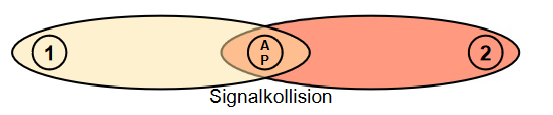

# Wlan

[Zurück zur Übersicht](../readme.md)

## Gliederung

- [Standards und Begriffe](#standards-und-begriffe)
- [WLAN Carrier Sense Multiple Access](#wlan-carrier-sense-multiple-access)
- [WLAN Gerätetypen](#wlan-gerätetypen)
- [WLAN Sicherheit](#wlan-sicherheit)
- [Quellen](#quellen)

----
----

## Standards und Begriffe

- WLAN == Wireless Local Area Network
- Ist die allgemeine Bezeichnung für lokale Funknetze
- Meist ist der Standard IEEE802.11 mit seinen einzelnen Definitionen gemeint
- Der Standard IEEE802.11 wurde 1997 definiert 
- Der Wireless-Acces-Point ist das aktive Netzgerät im Wlan, ähnlich einem Switch im Kabelnetzwerk
- Standardisierte Übertragungsfrequenzen: 2,4GHz, 5GHz, 60GHz
- Bei Standard IEEE802.11 theorethische Übertragungsrate 2 MBit/s
- Bei Standard IEEE802.11ac (5GHz) theorethische Übertragungsrate 7 GBit/s
- In der Praxis liegen die Übertragungsraten **signifikant** unter diesen Werten

Präsentation WLAN [[PDF]](./material/FI_LF9_05_WLAN_20221212.pdf)

[Hoch](#gliederung)

---
---

## WLAN Carrier Sense Multiple Access

- All Nutzer teilen sich die Verfügbaren Kanäle
- Pro Kanal kann nur 1 Teilnehmer senden
- WLAN Client prüft ob Kanal frei ist - Listen-Before-Talk (LBT)
- Ist der Kanal beegt wartet der WLAN Client eine zufällige Zeit (42 bis 178μ)

Abb.1 WLAN Kollision [Quelle](#abbildungen)

[Hoch](#gliederung)

---
---

## WLAN Gerätetypen

- **WLAN-Client**
    - Endsystemder WLAN-Nutzung, z.B.Notebook einesNutzers
- **WLAN Access Point**
    - Zentrale Schnittstelle für Endsysteme eines WLAN 
    - Stelltin der Regel die VerbindungzwischenWLAN und LAN her
- **WLAN Repeater**
    - Gerät zur Reichweitenerhöhung im WLAN
    - Halbierung des Durchsatzes, da Signal wiederholt wird
- **Wireless LAN Controller**
    - Steuerungdes Betriebs mehrerer WAP
    - WLAN-Profile / -Konfiguration zentral eingerichtet und an WAPs verteilt

[Hoch](#gliederung)

---
---

## WLAN Sicherheit

- Funknetze ermöglichen ein einfaches Mithören des Datenverkehrs
- Deshalb ist ein Muss:
    - Authentifizierung von Benutzern und WLAN-Clients 
    - Verschlüsselung der Kommunikation
- Verfahren:
    - Wired EquivalentPrivacy (WEP) -unsicher und veraltet
    - Wi-Fi ProtectedAccess (WPA)  -veraltet
    - Wi-Fi Protected Access 2 (WPA2) - veraltet
    - WPS (unsicher und aktuell)
    - WPA3 (sicher und aktuell)
- Deutsches Recht:
    - Für Schäden durch ein ungesichertes WLAN haftet der Betreiber. Der Betrieb WLAN-Router oder Access Point sollte immer mit Authentifizierung und Verschlüsselung erfolgen.
- **WEP**: schwache Verschlüsselung und Authentifizierung
- **WPA**: dynamische Schlüssel, gute Authentifizierung und Unterstützungvon Radius-Authentifizierung
- **WPA2**: Implementierung AdvancedEncryption Standard (AES)
- **WPA3**: lange AES Schlüssel und Ersatz des pre-shared key(PSK)-Verfahrens (einheitliches Passwort) / sicheres Aushandeln Sitzungsschlüssel / bei Kenntnis des WLAN-Passworts keine im voraus aufgezeichneten Datenpakete nachträglich entschlüsselbar
- WPA2 Enterprise ModeNutzerbezogene Kennung und Passwort / Authentifizierung per RADIUS
- WPA2 Personal Mode (PSK)Die Authentifizierung erfolgt mit einem gemeinsamen Pre-Shared-Key (Passwort).

### WLAN Sicherheit mit RADIUS

- Remote Authentication Dial-In User Service (RADIUS)
- RADIUS ist ein Client-Server-Protokoll für
    - Authentifizierung,
    - Autorisierung und
    - Accounting von Nutzern. (Triple-A-System) 
- Nutzung bei Einwahlverbindungen in ein Netzwerk, RADIUS ist Standard bei der zentralen Authentifizierung von Einwahlverbindungen mittels WLAN
- Vorteil: einmalig und zentral registrierte Zugangsdaten der Nutzer
- Nachteil: bei Störung sind alle nutzenden Dienste gleichzeitig betroffen

### WLAN Voucher-oder Ticketsystem

- Nutzung individueller Codes („Voucher“ oder “Tickets”)
- Ermöglicht Gästen Zugang zum WLAN
- Nachvollziehbarkeit des individuellen Nutzerzugangs
- Gültigkeit und Dauer wählbar
- Bestätigung von Nutzungsbedingungen
- Einsatz in Hotels und bei Gästen in der Firma

[Hoch](#gliederung)

---
---

## Quellen

### Inhalt

- Unterrichtsmaterialien BSZETDD (Herr Hempel)

### Abbildungen

- Abb. 1: Unterrichtsmaterialien BSZETDD (Herr Hempel)
- Präsentation WLAN: Unterrichtsmaterialien BSZETDD (Herr Hempel)

[Hoch](#gliederung)

---
---