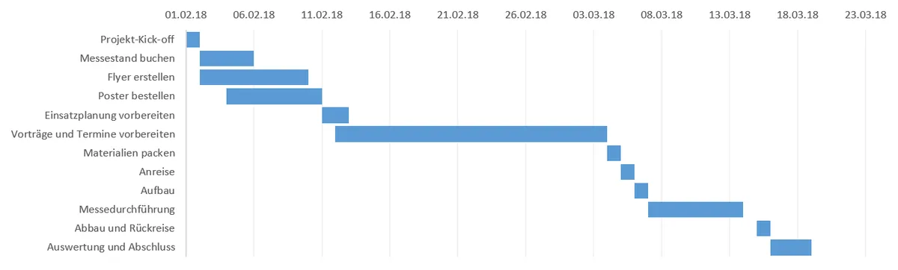
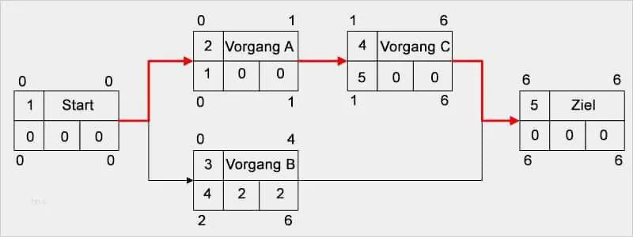
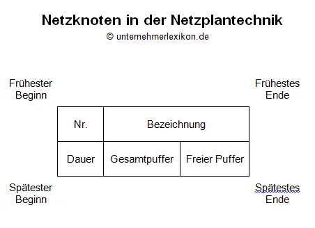
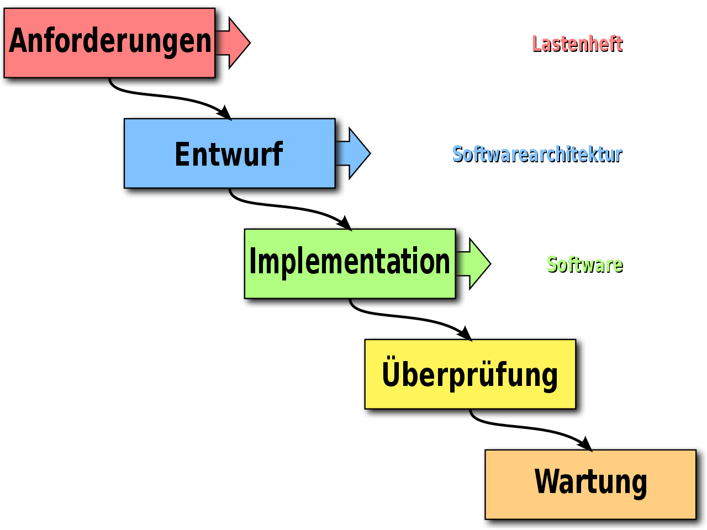
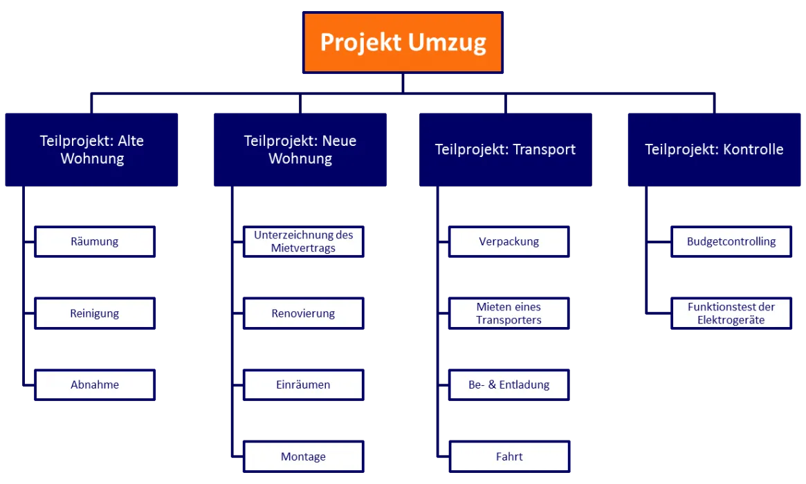

# Diagramme und Pläne

[Zurück zur Übersicht](../readme.md)

## Gliederung

- [Gantt-Diagramm](#gantt-diagramm)
- [Netzplan](#netzplan)
- [Wasserfallmodell](#wasserfallmodell)
- [Projektstrukturplan](#projektstrukturplan)
- [Quellen](#quellen)

---
---

## Gantt-Diagramm

- auch Balkenplan genannt
- stellt zeitliche Abfolge von Aktivitäten grafisch in Form von Balken auf einer Zeitachse dar

Vorteile|Nachteile|
-|-|
Dauer der Aktivitäten wird durch Balkenlänge sichtbar wiedergegeben | Abhängigkeiten zwischen Aktivitäten zeitbezogen Darstellung
Ende-Start-Beziehungen können auch im Verlauf einer Aktivität angesetzt werden

Abb. 1 [Original](https://projekte-leicht-gemacht.de/blog/pm-tools/gantt-diagramm-excel/)

- die Aktivitäten eines Projekteswerden in die erste Spalte einer Tabelle eingetragen.
- erste Zeile der Tabelle -> darstellen Zeitachse
- einzelnen Aktivitäten -> visualisiert in jeweiliger Zeile mit waagerechten Balken
- je länger der Balken -> desto länger dauert die Aktivität (Tage, Monate, Stunden usw.)
- sich überschneidende Aktivitäten werden durch überlappende Balken dargestellt
- Visualisierung des kritischen Pfades möglich
- Abhängigkeiten zwischen den Aktivitäten -> Einfügen von Pfeilen
- **vorher** detaillierter Projektplan erstellen
- Projekte haben ein Anfangsdatum -> entspricht Anfangsdatum der ersten Aufgabe
- ein Enddatum -> entspricht dem Ende der letzten auszuführenden Einzelaufgabe

[Hoch](#gliederung)

---
---

## Netzplan

- Zeichnerische Darstellung des geplanten Projektablaufs
- Vorgangsknotennetz

Vorteile | Nachteile |
-|-|
Puffer können einfach dargestellt werden | kann nur von *geübten* gelsen werden
Kritischer Pfad erkennbar | wird schnell unübersichtlich

Abb. 2 [Original](https://www.siwicadilly.com/vorgangsknotennetzplan-vorlage/vorgangsknotennetzplan-vorlage-gut-beispiel-fr-eine-netzplan-vorgangstabelle-in-powerpoint/)

Kürzel | Beschreibung |
-|-|
FAZ | Frühester Anfangszeitpunkt|
FEZ | Frühester Endzeitpunkt |
SAZ | Spätester Anfangszeitpunkt|
SEZ | Spätester Endzeitpunkt |
D | Dauer |
GP | Gesamtpuffer |
FP | Frier Puffer |

Abb. 3 [Quelle](https://www.unternehmerlexikon.de/netzplantechnik/)

- FEZ = FAZ + D
- SAZ = SEZ - D
- SEZ *(Vorgänger)* = frühester SAZ der nachfolger
- FAZ *(Nachfolger)* = spätester FEZ der Vorgänger
- *im kritischen Pfad: FEZ=SEZ*
- GP = SAZ - FAZ
- FP = FAZ *(Nachfolger)* - FEZ

[Hoch](#gliederung)

---
---

## Wasserfallmodell

- lineares Vorgehensmodell (**nicht** iterativ)
- für alle Phasen des Wasserfallmodells müssen Dokumentationen verfasst werden
- am Ender der Phase ist die Dokumentation gleichzeitig ein Meilenstein des Projekts
- Beispiele für Dokumentationen:
  - Lastenheft
  - Pflichtenheft

Vorteile | Nachteile |
-| -|
Einfache und verständlicher Struktur | keine Flexibilität
wenig Managementaufwand | keine Rücksprungmöglichkeiten in frühere Phasen |
Konsequente Dokumentation | Kunde ist nur zu Beginn und am Ende beteiligt |

Abb. 4 [Quelle](https://de.wikipedia.org/wiki/Wasserfallmodell#/media/Datei:Waterfall_model-de.svg)

[Hoch](#gliederung)

---
---

## Projektstrukturplan

- Herzstück jeden Projektes
- ist das Ergebnis einer Gliederung des Projektsin plan-und kontrollierbare Elemente
- Projekte werden in Teilaufgaben und Arbeitspakete unterteilt
- ist die Grundlage für die Termin-und Ablaufplanung, die Ressourceneinplanung und die Kostenplanung
- Darstellungsziel -> Übersichtlichkeit

Vorteile | Nachteile |
-|-|
vollständige Erfassung des Projekts | keine Nachteile, höchstens Grenzen |
Klarheit über zu leistende Arbeiten | |
Einigung über Projektziele | |
Verinnerlichung des Projekts | |

- Datstellungsmöglichkeiten
  - Vetikal als Organigramm
  - Horizontal als Baumdiagramm
  - Textdarstellung mit Einrückungen

Abb. 5 [Quelle](https://www.affinis.de/fachartikel/projektmanagement/projektstrukturplan-erstellung-und-nutzung/)

[Hoch](#gliederung)

---
---

## Quellen

### Inhalt

- Unterrichtsmaterialien des BSZ-ET Dresden
- Buch *Prüfungsvorbereitung Aktuell - Teil 1 der gestreckten Abschlussprüfung "Einrichtung eines IT-gestützten Arbeitsplatzes"* -  [Europa Lehrmittel]

### Abbildungen

- Abb. 1: <https://projekte-leicht-gemacht.de/blog/pm-tools/gantt-diagramm-excel/>
- Abb. 2: <https://www.siwicadilly.com/vorgangsknotennetzplan-vorlage/vorgangsknotennetzplan-vorlage-gut-beispiel-fr-eine-netzplan-vorgangstabelle-in-powerpoint/>
- Abb. 3: <https://www.unternehmerlexikon.de/netzplantechnik/>
- Abb. 4: <https://de.wikipedia.org/wiki/Wasserfallmodell#/media/Datei:Waterfall_model-de.svg>
- Abb. 5: <https://www.affinis.de/fachartikel/projektmanagement/projektstrukturplan-erstellung-und-nutzung/>

[Hoch](#gliederung)
