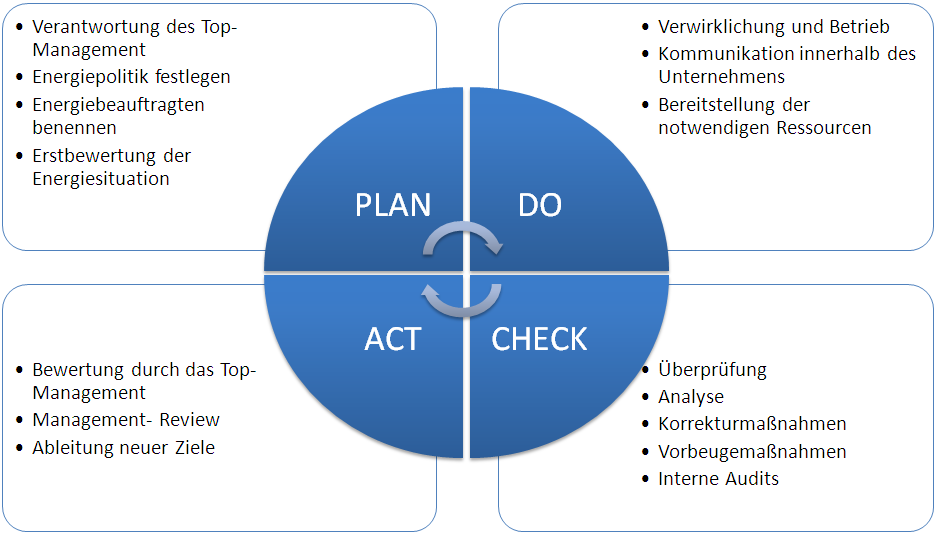

# DIN EN ISO 9000ff

[Zurück zur Übersicht](../readme.md)

## Gliederung

- Normenreihe
- [DIN EN ISO 9000 ff](#din-en-iso-9000-ff)
- PDCA-Zyklus
- [Quellen](#quellen)


---
---

## Normenreihe

```bash
Die Normenreihe DIN EN ISO 9000 ff bildet die Grundlage für die Planung und Umsetzung eines Qualtitäsmanagementsystems.
In den einzelnen Normen werden bestimmte Bereiche dieser Thematik abgedeckt.
Im rahmen einer Zertifizierung können die Firmen nachweisen, dass sie das Qualitätsmanagement im Sinne der Norm durchführen
und ein Qualitätsmanagementsystem implementiert haben. Eine solche Zertifizierung nennt sich Audit und wird durch einen Auditor durchgeführt.
```

[Hoch](#gliederung)

---
---

## DIN EN ISO 9000 ff

### 9000

- diese Norm definiert Grundbegriffe der Norm und nennt auch die Grundsätze des Qualitätsmanagements

### 9001

- Diese Norm beschreibt die Mindestanforderungen an ein Qualitätsmanagementsystem
- damit ist Sie auch Grundlage für eine Zertifizierung

### 9004

- Diese Norm beschäftigt sich mit dem Lenken und Leiten einer Organisation im Sinne eines nachhaltigen Erfolges und knüpft auch an das **Total Quality Management TQM** an.

[Hoch](#gliederung)

---
---

## PDCA-Zyklus



Abbildung 1

[Hoch](#gliederung)

---
---

## Quellen

### Abbildungen

- Abb.1: <https://de.wikipedia.org/wiki/Demingkreis#/media/Datei:PDCA_Zirkel_-_ISO_50001.png>

[Hoch](#gliederung)

---
---
