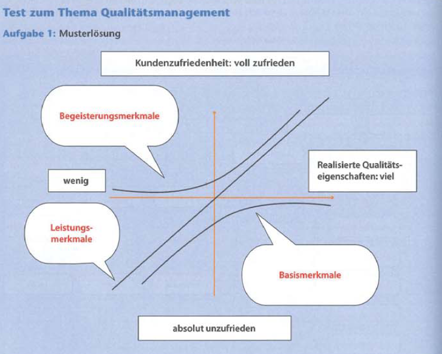

# Grundlagen Qualitätsmanagement

[Zurück zur Übersicht](../readme.md)

## Gliederung

- [Grundbegriffe](#grundbegriffe)
- Qualitätsaspekte
- [Modell von Kano](#modell-von-kano)
- Barrierefreiheit
- [Quelle](#quellen)

---
---

## Grundbegriffe

- `Qualität`: Grad, in dem ein Satz inhärenter Merkmale eines Objekts Anforderungen erfüllt
- `DIN`: Deutsches Institut für Normung
- `EN`: Europäisches Normungsinstitut
- `ISO`: International Organisation for Standardization
- `IEC`: International Electronical Comission

[Hoch](#gliederung)

---
---

## Modell von Kano

Abbildung 1

[Hoch](#gliederung)

---
---

## Quellen

### Abbildungen

- Abb.1: Rosa Buch

[Hoch](#gliederung)

---
---