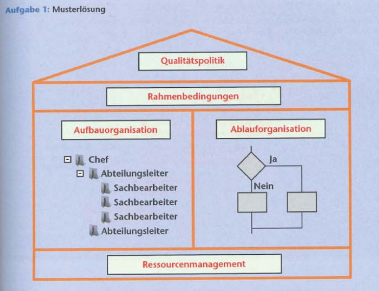
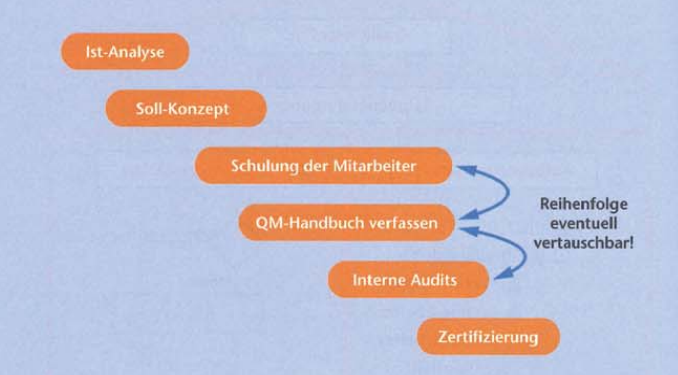
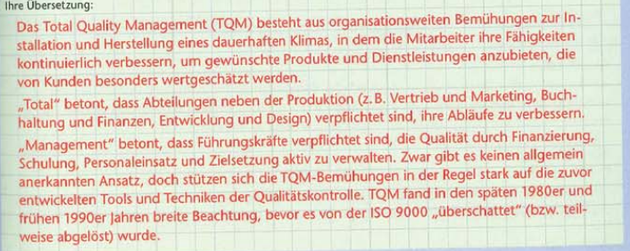

# Qualitätsmanagementsysteme

[Zurück zur Übersicht](../readme.md)

## Gliederung

- [Organisationsaufbau](#organisationsaufbau)
- [Begriffe](#begriffe) 
- [Total Quality Management](#total-quality-management)

---
---

## Organisationsaufbau

Abbildung 1

[Hoch](#gliederung)

---
---

## Begriffe

- `Qualitätsplanung`: Teil des Qualitätsmanagements, der auf das Festlegen der Qualitätsziele und der notwendigen Ausführungsprozesse sowie der zugehörigen Ressources zum Erreichen der Qualitätsziele gerichtet ist
- `Qualitätspolitik`: Die Leistung einer Organisation drückt ihre Übergeordnete Absichten und Ausrichtung bezüglich der Qualität in Form der Qualitätspolitik aus

Abbildung 2

[Hoch](#gliederung)

---
---

## Total Quality Management

Abbildung 3

[Hoch](#gliederung)

---
---

## Quellen

### Abbildungen

- Abb.1: Rosa Buch
- Abb.2: Rosa Buch
- Abb.3: Rosa Buch

[Hoch](#gliederung)

---
---