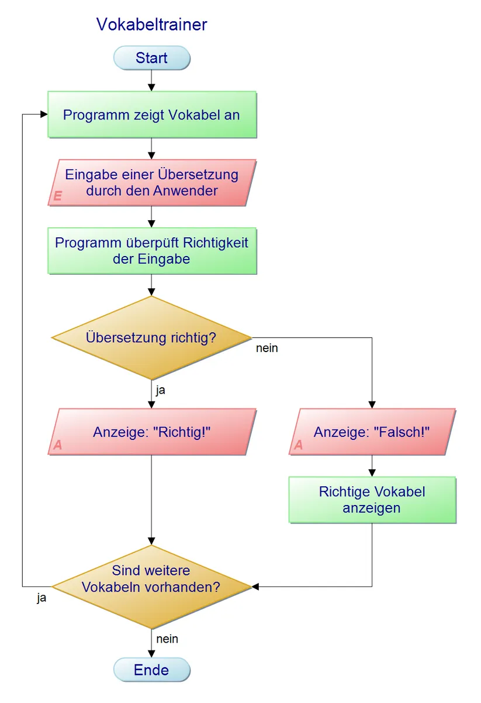
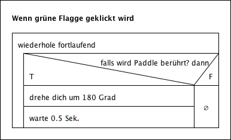
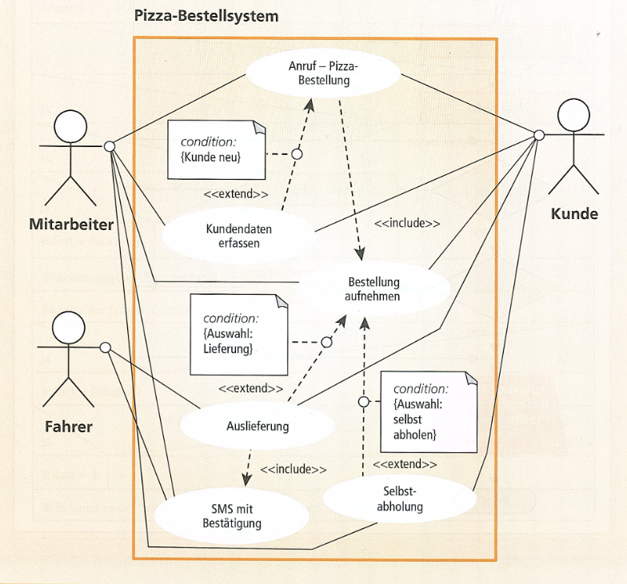
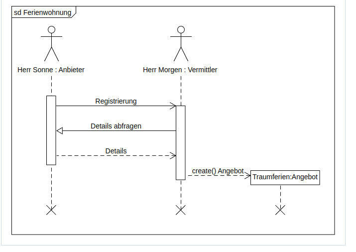
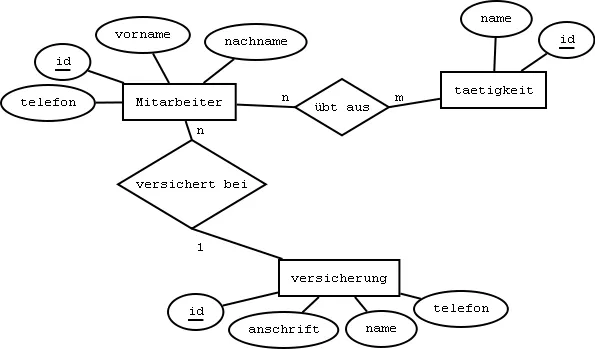

# Diagramme und Pläne

[Zurück zur Übersicht](../readme.md)

## Gliederung

- [Pseudocode](#pseudocode)
- [Programmablaufplan](#programmablaufplan)
- [Struktogramm](#struktogramm)
- [UML-Klassendiagramm](#uml-klassendiagramm)
- [UML-Use-Case-Diagramm](#uml-use-case-diagramm)
- [Sequenzdiagramm](#sequenzdiagramm)
- [Entity Relationship Diagramm](#entity-relationship-diagramm)
- [Quellen](#quellen)

---
---

## Pseudocode

- ähnelt höheren Programmiersprachen
- ist aber nicht Ausführbar
- dient zu Veranschaulichung für den Menschen

``` bash
Variable a int = 5
Variable b int = 10
Variable Ergebnis int

Ergebnis = Summe aus a und b

Ausgabe Ergebnis

```

[Hoch](#gliederung)

---
---

## Programmablaufplan

- genormt nach DIN 66001
- zeigt welche Befehle an die DVA gegeben werden und in welcher Reihenfolge sie ausgeführt werden müssen
- besteht aus genormten Sinnbildern, welche durch Flusslinien miteinander verbunden sind
- im Programm enthaltenen Arbeitsschritte und Verzweigungen sind dargestellt
- dienen dazu, die Ablauffolge des Programms durch besondere Symbolik und ein Netz von Verbindungslinien grafisch darzustellen



Abb. 1 [Quelle](https://herrschultz.info/doku.php?id=info:sek1:algorithmierung)

[Hoch](#gliederung)

---
---

## Struktogramm

- genormt nach DIN 66261
- entwickelt von Nassi-Schneidermann
- äußeres Sinnbild ist ein Rechteck, welches durch Linien unterteilt wird
- keine genormte Größe
- erläuternde Texte sind in das Sinnbild einzutragen
- Gesamtaufgabe wird hierarchisch von oben nach unten in Teilaufgaben gegliedert



Abb. 2 [Quelle](https://ngb.schule/wiki/Struktogramm)

[Hoch](#gliederung)

---
---

## UML-Klassendiagramm

- ist ein Strukturdiagramm
- dient zur graphischen Darstellung von Klassem, Schnittstellen sowie Beziehungen

.jpg)

Abb. 3 [Quelle](#quellen)


Abb. 4 [Quelle](#quellen)

[Hoch](#gliederung)

---
---

## UML-Use-Case-Diagramm

- *deutsch:* **Anwendungsfall-Diagramm**
- beschreibt die Funktionalitäten eines Systems nur grob
- zeigt mögliche Anwendungsfälle des Systems
  - Anwendungsfälle sind Funktionalitäten oder Geschäftsprozesse
- zeigt Beziehungen zwischen Anwendungsfällen und Akteuren
  - Akteure sind Personen oder Maschinen (externe Systeme)
- Ziele des Anwendungsfalldiagramms:
  - Grundlage zur Identifikation von beteiligten Klassen
  - Grundlage zur Erstellung von Testplänen

[Weitere Informationen](./material/anwendungsfalldiagramm.pdf) [**PDF**]

PDF 1 [Quelle](#quellen)



Abb. 5 [Quelle](#quellen)

[Hoch](#gliederung)

---
---

## Sequenzdiagramm

- sinnvoll für detaillierte Modellierung von Teilsystemen
- Darstellung der Kommunikation zwischen Objekten
- Kommunikation in Form einzelner richtungsgebundenerNachrichten
- Darstellung der zeitlichen Abfolge des Nachrichtenaustauschs
- jedes Objekt besitzt eine Lebensline
  - Zeitraum, in dem das Objekt betrachtet wird
- Objekte von Personen als Strichmännchen
- Objekte von Systemen als Rechteck

[Weitere Informationen](./material/sequenzdiagramm.pdf) [**PDF**]

PDF 2 [Quelle](#quellen)



Abb. 6 [Quelle](#quellen)

[Hoch](#gliederung)

---
---

## Entity Relationship Diagramm

- ist die graphische Darstellung von Entitäts- und Beziehungstypen

[Weitere Informationen](./material/Datenbankmodellierung%20und%20Normalisierung.pdf) [**PDF**]

PDF 3 [Quelle](#quellen)

[ERD-Hilfsblatt](./material/erd_hilfsblatt.pdf) [**PDF**]

PDF 4 [Quelle](#quellen)



Abb.7 [Quelle](https://www.informatikzentrale.de/erd-relationenmodell.html)

[Hoch](#gliederung)

---
---

## Quellen

### Inhalt

- Unterrichtsmaterialien des BSZ-ET Dresden
- Buch *Prüfungsvorbereitung Aktuell - Teil 1 der gestreckten Abschlussprüfung "Einrichtung eines IT-gestützten Arbeitsplatzes"* -  [Europa Lehrmittel]

### Abbildungen

- Abb. 1: <https://herrschultz.info/doku.php?id=info:sek1:algorithmierung>
- Abb. 2: <https://ngb.schule/wiki/Struktogramm>
- Abb. 3: Tafelbild aus Lehrgang *Objektorientierung in C#*
- Abb. 4: Handreichung Lehrgang *Objektorientierung in C#*
- Abb. 5: Unterrichtsmaterialien des BSZ-ET Dresden - Herr Burggraf (LF8)
- Abb. 6: Unterrichtsmaterialien des BSZ-ET Dresden - Herr Burggraf (LF8)
- Abb. 7: <https://www.informatikzentrale.de/erd-relationenmodell.html>

### PDFs

- PDF 1: Unterrichtsmaterialien des BSZ-ET Dresden - Herr Burggraf (LF8)
- PDF 2: Unterrichtsmaterialien des BSZ-ET Dresden - Herr Burggraf (LF8)
- PDF 3: Unterrichtsmaterialien des BSZ-ET Dresden - Herr Burggraf (LF5)
- PDF 4: Unterrichtsmaterialien des BSZ-ET Dresden - Herr Burggraf (LF5)

[Hoch](#gliederung)

---
---
