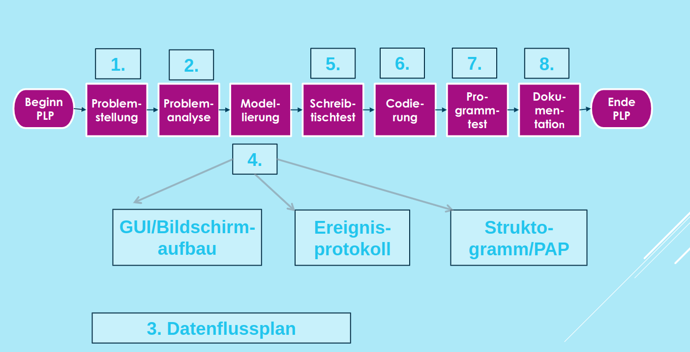

# Grundlagen Software

[Zurück zur Übersicht](../readme.md)

## Gliederung

- [Grundbegriffe](#grundbegriffe)
- [Einordung von Programmiersprachen](#einordung-von-programmiersprachen)
- [Algorithmen](#algorithmen)
- [Softwareentwicklungsprozess](#softwareentwicklungsprozess)
- [Fehlersuche (Debugging)](#fehlersuche-debugging)
- [Quellen](#quellen)

---
---

## Grundbegriffe

- **Syntax**:
  - ist eine formale Grammatik
  - ermöglicht erlaubte Konstruktionen festzulegen und unerlaubte Konstruktionen auszuschließen
- **Semantik**
  - Bedeutung eines speziellen Symbols innerhalb der Programmier-sprache
- **Algorithmus**
  - ist eine fest definierte und endliche Vor-gehensweise
  - mit dieser kann ein Problem oder eine Klasse von Problemen gelöst werden
- **Software**
  - Summe der Programme und Daten eines IT-Systems
- **Software-Produkt**
  - Software inklusive Dokumentation
- **Programm**
  - Algorithmus einschließlich erforderlicher Daten in einer Computer verständlichen Sprache
- **Softwarentwicklungswerkzeug**
  - aufeinander abgestimmte und durchgänige Anwendung, die den Prozess der Entwicklung von Software-Systemen unterstützen
- **Programmiersprache**
  - Sprache zur Formulierung von Verarbeitungsvorschriften, die von einem IT-System ausgeführt werden können
- **Befehl**
  - Einzelanweisung für einen Computer
- **Anweisung**
  - selbstständige Einheit zur Verarbeitung von Daten auf einem Computer, besteht aus einer Vielzahl von Befehlen

[Hoch](#gliederung)

---
---

## Einordung von Programmiersprachen

### Maschinensprachen

- Sprachelemente: 0,1 prinzipiell binär/hexadezimal codiert
- werden aufgrund des Aufbaus direkt vom Prozessor abgearbeitet
- schwer verständlich und unübersichtlich (komplexere Programmierung sind fast nicht umsetzbar)
- jede Programmierung muss beim kompilieren in Maschinencode umgewandelt werden
- nur für Spezialisten

### Assemblersprachen

- Zwischencode, maschinennah
- zu binären Codes werden leichter merkbare Kürzel („Mnemonics“) zugeordnet
- „Mnemonics“ werden in Maschinencode übersetzt

### Höhere Programmiersprachen

Interpreter | Compiler|
-|-|
... ist ein Programm, das ein in einer höheren Programmier-sprache geschriebenes Programm nach einer erfolgreichen Überprüfung der Syntax zeilenweisein Maschinencode übersetzt (Interpretiert) und sofort ausführt.|...ist ein Programm, das ein in einer höheren Programmier-sprache geschriebenes Programm nach einer erfolgreichen Über-prüfung der Syntax komplettin Maschinencode übersetztund als ausführbares Programm (Kompiliert)speichert.|
---

- **Prozedual**

Schlagwort | Beschriebung|
-|-|
Vorgehensweise | Beschreibung von Programmabläufen, Weg zur Problemlösung wird als Folge von Einzelschritten angegeben, Entwicklung eines Algorithmus ist als Vorstufe der Programmierung anzusehen |
Problemanalyse | durch Modularisierung (Zerlegung in Aufgaben) und schrittweise Verfeinerung |
Modellierung | Struktogramm/PAP
Programmiersprachen | Pascal, PHP, C, Basic

- **Funktional**

Schlagwort | Beschriebung|
-|-|
Vorgehensweise | u. A. zur Lösung mathematischer Probleme genutzt, Erstellung von Funktionen mit Eingabe-und Ausgabeparametern (Definitions-und Wertebereich), diese Funktionen können von anderen Funktionen aufgerufen und deren Ergebnis als Parameter genutzt werden |
Problemanalyse | durch Modellierung von Funktionen und deren Parametern |
Modellierung | Datenflussdiagramm
Programmiersprachen | Lisp -> Einsatz in Informatik vorwiegend im Forschungsbereich der künstlichen Intelligenz |

- **Prädikativ/Logisch**

Schlagwort | Beschriebung|
-|-|
Vorgehensweise | Programm verfügt über Wissen und Methoden zur Wissensauswertung,Nutzer können durch gezielte Fragestellungen Wissen abfragen und erhalten als Antwort „Ja“ oder „Nein“, Keine Vorgabe eines Algorithmus zur Problemlösung, Anwendung: Medizin, technische Diagnostik, Ahnenforschung |
Problemanaylse | durch Analyse einer Wissensbasis |
Modellierung | Liste von Fakten und Regeln (Bedingung für korrekte Lösung) |
Programmiersprachen | PROLOG |

- **Objektorientiert**

Schlagwort | Beschriebung|
-|-|
Vorgehensweise | Im Mittelpunkt stehen vordefinierte oder selbsterstellte Objekte (Komponenten), Objekte können visuell oder nichtvisuell sein, Objekten werden Eigenschaftswerte (Attribute) und Ereignisroutinen (Methoden) zugeordnet |
Problemanalyse | durch Ermittlung von Klassen mit Attributen und Methoden sowie deren Beziehungen zueinander |
Modellierung | UML |
Programmiersprachen | PHP, JAVA,Visual Basic, Delphi, C++, C# |

[Hoch](#gliederung)

---
---

## Algorithmen

### Datentypen

Datentyp | Datentypklasse | Wertebereich |
-|-|-|
string| Zeichenkette | beliebig viele Zeichen |
char | **ein** Zeichen | ein Zeichen |
bool | Boolean | true, false |
decimal | Fließkommazahl | ±1.0 × 10-28 to ±7.9228 × 1028, Genauigkeit: 28-29 signifikante Stellen |
double | Fließkommazahl | ±5,0 × 10−324 bis ±1,7 × 10308, Genauigkeit: 15-17 signifikante Stellen |
Float | Fließkommazahl | ±1.5 × 10−45 zu ±3.4 × 1038, Genauigkeit: 6-9 signifikante Stellen |
byte | Ganzzahl | 0 ... 255 |
short | Ganzzahl | –32.768 bis 32.767 |
int | Ganzzahl | -2,147,483,648 bis 2,147,483,647 |
long | Ganzzahl | -9,223,372,036,854,775,808 bis 9,223,372,036,854,775,807 |

### Sequenz

- Die Sequenz ist eine Folge von Anweisungen, die nacheinander (sequentiell) abgearbeitet werden
- Im C#-Quelltext könnte die Sequenz so aussehen:
  
  ```c#
  c = a + b; // Anweisung 1
  d = a * b; // Anweisung 2
  e = a / b; // Anweisung 3 
  ```

### Selektion/Auswahl/Verzweigung

- Es werden Bedingungen ausgewertet (Wahrheitswerte)
- Ist die Bedingung wahr, dann wird der Code ausgeführt
- Ist die Bedingung falsch, dann wird **kein** Code ausgeführt
- C# Beispiel:

  ```c#
  // ist der Fahrstuhl vorhanden 
  if (istFahrstuhlVorhanden)
  {
  // ... dann 1000 Euro zu den Betriebskosten addieren
  Betriebskosten = Betriebskosten + 1000;
  }
  ```

- Die Selektion kann auch zweiseitig erfolgen
- Ist die Bedingung wahr, dann wird der Code ausgeführt
- Ist die Bedingung falsch, dann wird **anderer** Code ausgeführt
- C# Beispiel:
  
  ```c#
  // ist Ampelfarbe gleich rot?
  if (Ampelfarbe == "rot")
  {
   // ... dann bremsen
   Console.WriteLine("bremsen");
  }

  // ist Ampelfarbe NICHT rot?
  else
  {
   Console.WriteLine("weiterfahren");
  }
  ```

- Die Selektion kann auch mehrseitig erfolgen
- Es werden Variablenwerte ausgewertet
- Je nach Wert der Variablen wird unterschiedlicher Code ausgeführt
- C# Beispiel:
  
  ```C#
    // je nach Ampelfarbe
  switch (Ampelfarbe)
  {
   // Ampelfarbe ist rot
   case "rot":

    // Ausgabe
    Console.WriteLine("bremsen");
    break;

   // Ampelfarbe ist grün
   case "grün":

    // Ausgabe
    Console.WriteLine("weiterfahren");
    break;

   // Ampelfarbe ist gelb
   case "gelb":

    // Ausgabe
    Console.WriteLine("entscheiden, ob bremsen oder weiterfahren";
    break;

   // Ampelfarbe ist weder rot, grün, gelb
   default:

    //Ausgabe
    Console.WriteLine("falsche Eingabe");
    break;
   }  
  ```

### Wiederholungen/Schleifen

- jede Schleife hat einen Schleifenkörper, welcher x mal wiederholt wird
- Kopfgesteuerte Schleifen
  - die Bedingung wird vor jedem Schleifendurchlauf geprüft
  - die Schleife kann 0 bis unendlich mal durchlaufen werden
  - C# Beispiel

    ```C#
    for (int i = 0; i < 5; i++) 
    {
      Console.WriteLine(i);
    }
    ```

- Fußgesteuerte Schleife
  - die Bedingung wird nach jedem Schleifendurchlauf geprüft
  - die Schleife wir midestens 1 mal durchlaufen
  - C# Beispiel:

    ```C#
    int i = 0;
    do 
    {
      Console.WriteLine(i);
      i++;
    }
    while (i < 5);
    ```

[Hoch](#gliederung)

---
---

## Softwareentwicklungsprozess



Abb. 1 Softwareentwicklungsprozess

[Hoch](#gliederung)

---
---

## Fehlersuche (Debugging)

- Woher stammt der Name Debugger:
  - Bug stammt aus dem Englischen für *Insekt*
  - da in den 1940er Jahren eine Motte im Relais eines der ersten Computer für einen Fehler sorgte
  - daraufhin kam die Bezeichnung Bug für Fehler
  - Debugger ist also ein Tool zum befreien von Fehlern
- Haltepunkt:
  - ist eine Markierung im Quellcode
  - wenn das Programm im Debug-Modus gestartet wird, hält das Programm am Haltepunkt an
  - der Nutzer kann nun den aktuellen Stand der Variablen einsehen
- Konditionaler Haltepunkt:
  - dabei wird eine Bedingung angegeben
  - ist die Bedingung nicht erfüllt, wird der haltepunkt übergangen
- Just-in-time-Debugging
  - während des Debuggens können Änderungen am Quellcode vollzogen werden
  - die Änderungen werden direkt berücksichtigt

[Hoch](#gliederung)

---
---

## Quellen

### Inhalt

- Unterrichtsmaterialien des BSZ-ET Dresden
- Buch *Prüfungsvorbereitung Aktuell - Teil 1 der gestreckten Abschlussprüfung "Einrichtung eines IT-gestützten Arbeitsplatzes"* -  [Europa Lehrmittel]

### Abbildungen

- Abb. 1: Unterrichtsmaterialien des BSZ-ET Dresden - Frau Bardon (LF5)

[Hoch](#gliederung)

---
---
